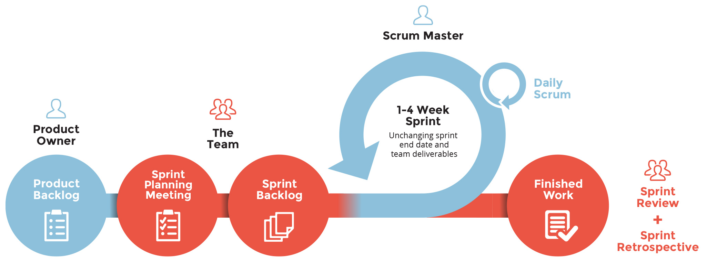

# 2. Requirement Analysis

## 2.1 Initial Requirements Analysis for _IF-ELSE_

By using Requirement gathering Techniques such as Questioneries, Brainstorming sessions, interviews, Initial Requirements are gathered and analyzed whether they are feasible for developement and determined whether the gathered requirements are unclear, incomplete, ambiguous, or contradictory, and then resolving these issues. Future requirements will be gathered further anywhere in the SDLC.

__*User demands following Requirements which are feasible for developement*__
- Silent phone through gps-location and time
- Schedule posts to your Social Media Account
- Application notifies user about any unfinished or pending work such as Reminding user to take their medicines or any other event.
- Implement a DnDX (Do not Disturb mode: Extended) mode in IF-ELSE which blocks the calls and notifications for a specific period of Time.
- Increase Ringer volume of the mobile phone whenever a phone call is missed or message(SMS) to your lost phone with the text "Where are you?" to increase Ringer volume.
- Automatically send Message whenever you leave your home.
- Open Music application whenever specific Bluetooth handset are connected to Mobile.
- Integrate with Slack or Asana using *IF-ELSE*.

## 2.2 Project Life Cycle Model

### Agile Project-management Approach
Agile is an iterative approach to project management and software development that helps teams deliver value to their customers faster and with fewer effort. Instead of betting everything on a "big bang" launch, an agile Developer team delivers work in small, but consumable, increments. Requirements, plans, and results are evaluated continuously so teams have a natural mechanism for responding to change quickly.
#### Why Agile?
Our Agenda is Customer Contribution and Satisfaction, This application must meet the Customer needs. Due to the Dynamic and changing Requirement nature of __IF-ELSE__, Developers needs constant feedback from the users for gathering requirements and Agile development can quickly adapt changes in product to be delivered. Thus, _Agile developement is the best option_. It provides a way for developers to deliver a better product, in a faster, through short and iterative manner. Agile Developement provides adaptability to change to the Developers. By using Agile development, customer can have a valuable and working products in hands at early stage of Project Developemtent Life Cycle (SDLC). 
## &nbsp;Scrum

Scrum is a Powerful, Popular & Simple framework for implementing agile processes in software development. 
<strong>In Scrum, There are some of the terminologies to understand in order to use Scrum </strong>  
<strong>Sprints</strong> are a short, time-boxed period when a scrum team works to complete a set amount of work. Sprints are at the very heart of scrum and agile methodologies, and getting sprints right will help your agile team ship better software with fewer efforts.  

<strong>Product Backlog</strong> is a prioritized list of work for the development team that is derived from the roadmap and its requirements. The most important items are shown at the top of the product backlog so the team knows what to deliver first. 

<strong>Sprint Backlog</strong> is a list of tasks identified by the Scrum team to be completed during the Scrum sprint. During the sprint planning meeting, the team selects some number of product backlog items. *__Note__: Product Backlog keeps changing, Here Project Manager prioritizes new tasks/requirements for next Cycles/Iterations*

<strong>Sprint Review</strong> is held at the end of the Sprint to inspect the Increment and adapt the Product Backlog if needed. There could have been a single Sprint Review deployment or many deployments during a Sprint which lead up to that Increment to be inspected.  

<strong>Sprint Meeting</strong> is held in somewhere between Sprint Cycle. The meeting is for the entire team, including the Scrum Master and product owner. All the stackholders are asked for status of the sprint in progress. 

<strong>Sprint Retrospective</strong> is held after the sprint review at the end of each sprint. During the retrospective, the team self-identifies elements of the process that did or did not work during the sprint, along with potential solutions. Retrospectives typically last 90 minutes and are there to help us incorporate continuous improvement into our team culture and into our Sprint cadence.
  
 
  
### Scrum Cycle 
__:heavy_check_mark: The product owner creates and prioritizes a product backlog. 
:heavy_check_mark: Teams select Requirements/Tasks from the backlog and determine how to complete the work. 
:heavy_check_mark: Work must be completed within a sprint (We will use 1 Week as a sprint Time-period). 
:heavy_check_mark: The Scrum master meets with teams briefly each day to get progress updates. 
:heavy_check_mark: Sprint reviews and retrospective are conducted at the end of each sprint. 
:heavy_check_mark: The process starts again until all work or backlog is complete.__ 

## 2.3 Problem Solving Techniques
### Potential Problems in POP technique
To develop __IF-ELSE__, we will use the bottom-up (object oriented) approach as a problem solving technique. The three main resons why we chose this approach are:
1. Nowadays, the procedure-oriented or top-down approach is getting obselete and problem with POP (Procedure Oriented programming techniques) was that it lack the idea of how to solve a real life situations. To design such a complex structure such as IF-ELSE, it becomes almost impossible to use POP technique.

2. Morever the Android SDK is completely based on Java which is completely object oriented. The whole Android framework is a collection of classes.

3. Another reason is that it becomes easy to visualize a problem as a collection of real-world objects. When developing a complex system, such as the User Interface in case of Android™, we can think of every drawable as an object, and then using the same baseline for deriving new views.
### Other Problems related to IF-ELSE are listed below,
### PR-1. Need of Customer Interaction with *IF-ELSE* team
After every iteration of the Agile SDLC(Sprints), customer feedback is evaluated. They must be in constant touch with the Development team.

#### Solution
To remain in constant touch with the Users, A portal for feedback and request for future requirements is available inside *IF-ELSE* which is used by users to enter their feedback and other requirements regarding *IF-ElSE*, A Confirmation mail will be sent to the requested user if the feedback is recieved and accepted.  

### PR-2. Need for Requirement Evaluation
Requirements must be feasible to be added to the Product Backlog. This addition and changes to the Requirements needs to be adapted by the Software in timely manner, otherwise the projects goals and milestones can't be achieved and this leads to customer dissatisfaction.

#### Solution
This problem can be solved or diminished by using Scrum's Retrospective meetings and Sprint Reviews in which Scrum master, development team analyzes the progress of the project and determine what must be improved during the Sprint process and discuss and understand how to adapt to new Requirements by prioritizing them.
  
